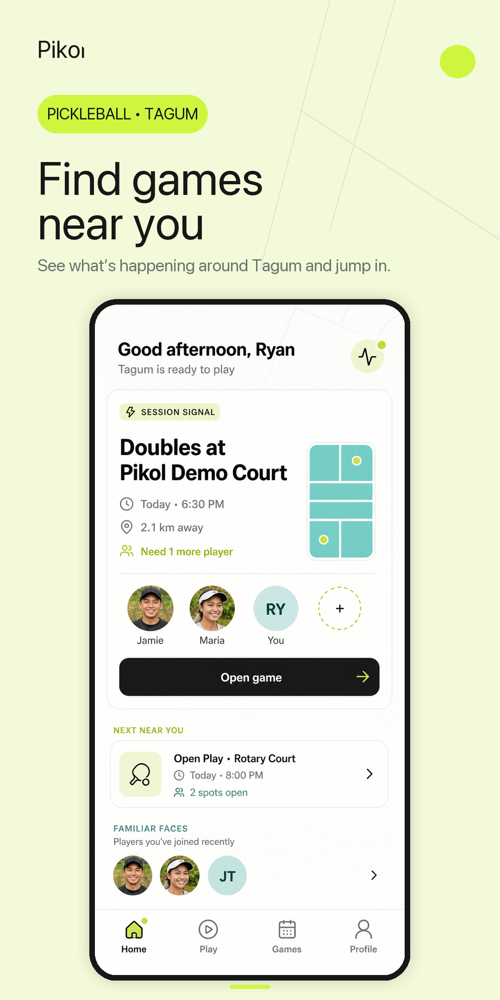
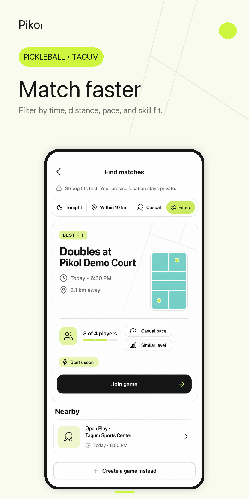
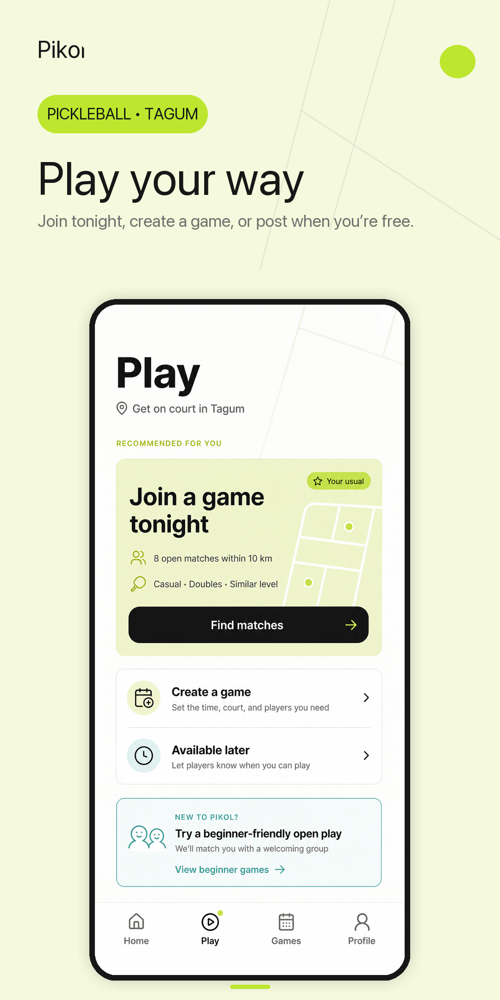

  

<h1 align="center">Pikol — Android test builds</h1>

  Find nearby pickleball games, fill open spots, and keep your group coordinated around Tagum City.

  <a href="../../releases/latest"><strong>Download the latest Android build</strong></a>
  ·
  <a href="https://pikol.ryandeniega.dev">Pikol website</a>
  ·
  <a href="../../issues">Report an issue</a>

> **Preview release:** this repository distributes installable Android test builds. Pikol's application source remains private.

## Find a game. Fill a spot. Get on court.

Pikol is built around the part of pickleball that usually takes the most coordination: finding people who are ready to play at the same time and place.

- See nearby games and open spots.
- Find matches by time, distance, pace, and skill fit.
- Create a game or post when you're available.
- Keep up with invites, court changes, and filled spots.
- Build a player profile around real participation and reliability.

## Preview the app

  
  
  

  Current Pikol product direction shown in store-preview artwork.

## Install on Android

1. Open the [latest release](../../releases/latest) on your Android phone.
2. Download the `.apk` file attached to the release.
3. If Android asks for permission to install apps from that source, allow it.
4. Tap **Install**, then open Pikol.
5. Sign in with your email. A six-digit code will be sent to you.

**Minimum supported version:** Android 7.0 (API 24) or newer.

## About these test builds

The APKs published here are signed for testing rather than with the future Google Play signing key. When Pikol moves to its Play Store build, Android may require you to uninstall this sideloaded version before installing the store version.

Uninstalling clears data stored only on the phone. Your Pikol account and server-backed game data return when you sign in again.

## Help us test Pikol

If something feels wrong, open an [issue](../../issues) and include:

- your phone model;
- Android version;
- the Pikol release you installed;
- what you were doing when the problem happened; and
- a screenshot or screen recording when useful.

Clear reports make it much easier to reproduce and fix issues before the public release.

## Privacy, terms, and support

- [Privacy policy](https://pikol.ryandeniega.dev/privacy)
- [Terms of service](https://pikol.ryandeniega.dev/terms)
- [Support](https://pikol.ryandeniega.dev/support)
- [Delete your account](https://pikol.ryandeniega.dev/delete-account)

Pikol is operated by **Ryan Christian D. Deniega**.
