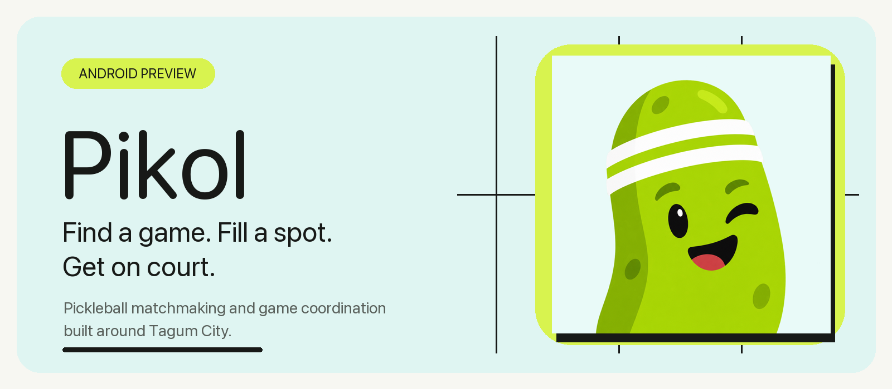
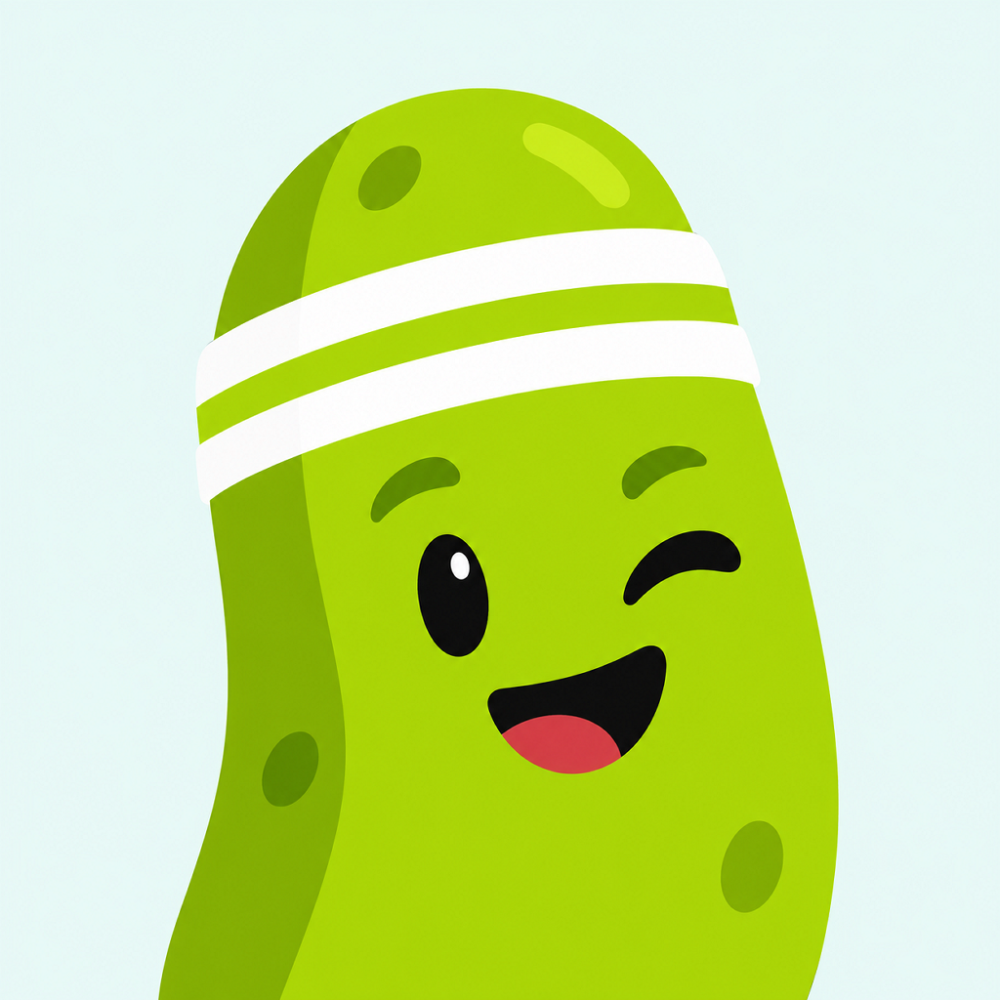
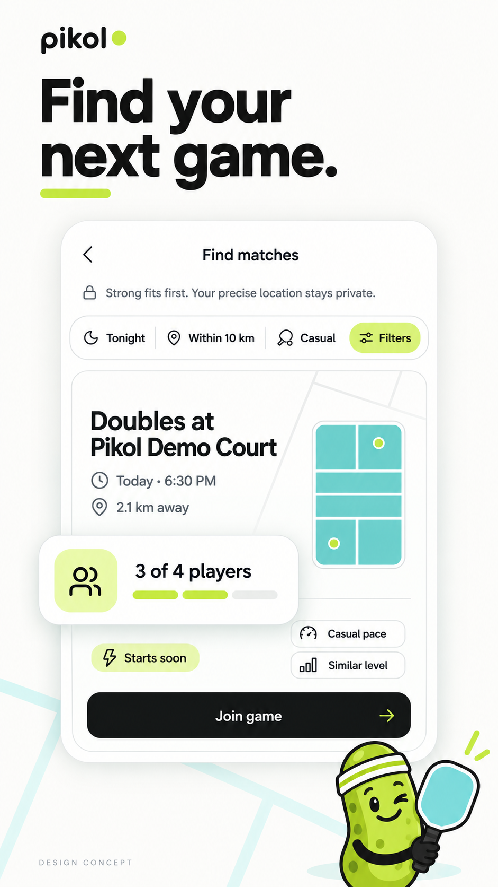
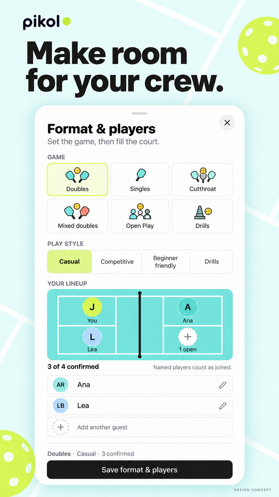
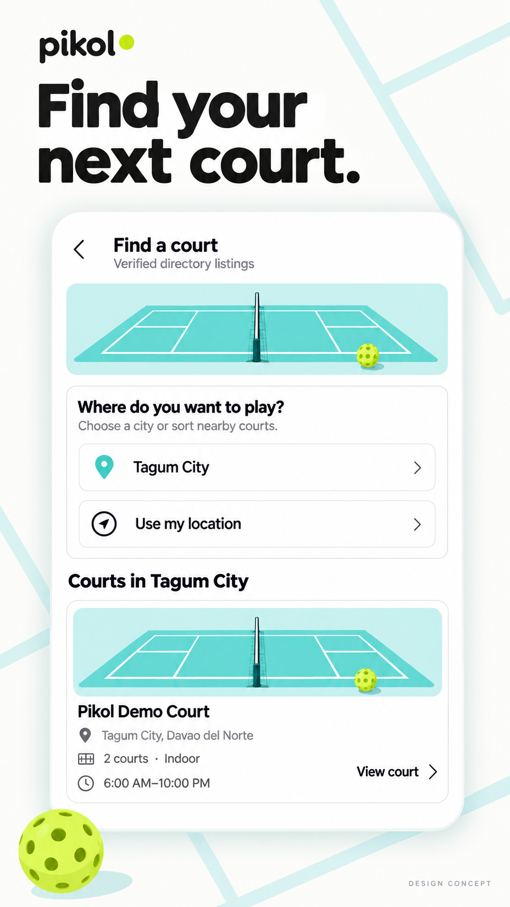
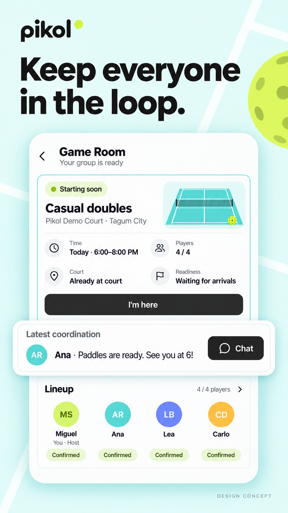
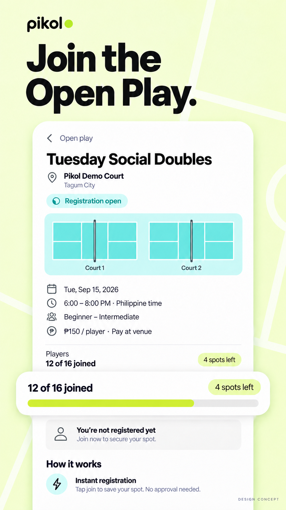
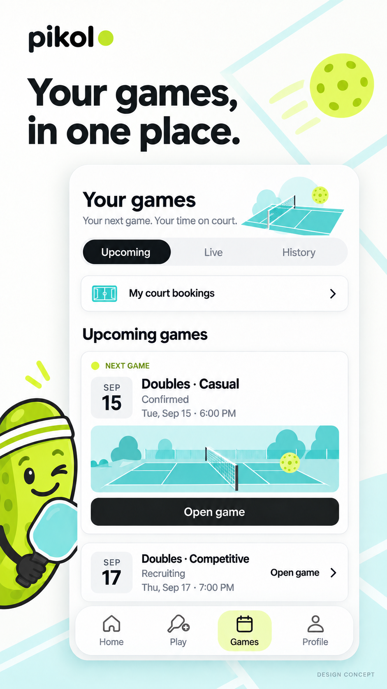

  

  

<h1 align="center">Pikol</h1>

  <strong>Find games. Build a crew. Get on court.</strong> 
  Pickleball matchmaking and game coordination built around Tagum City.

  <a href="https://github.com/SemiAutomat1c/pikol-releases/releases/latest"><strong>Download for Android</strong></a>
  ·
  <a href="https://pikol.ryandeniega.dev">Website</a>
  ·
  <a href="https://github.com/SemiAutomat1c/pikol-releases/issues">Report an issue</a>

> **Current Android preview:** [v1.0.0-preview.15](https://github.com/SemiAutomat1c/pikol-releases/releases/tag/v1.0.0-preview.15). This repository distributes installable Android preview builds. Pikol's application source remains private.

## Find your next game

Pikol is made for the coordination that happens before everyone gets on court. It helps players discover games, fill open spots, organize a crew, find courts, and keep upcoming games in one place.

- Find nearby games and open spots.
- Match by time, distance, pace, and skill fit.
- Create games and invite your crew.
- Discover courts and Open Play sessions.
- Keep up with game activity and changes.
- Build a player profile around real participation.

## See Pikol

  
  
  

  
  
  

  Product showcase concepts based on Pikol's current September 2026 design direction. Some content is illustrative and is not a literal release screenshot.

## Download the Android preview

The latest test build is **Pikol 1.0.0 preview 15**.

**APK:** `pikol-v1.0.0-preview.15.apk` 
**Minimum Android version:** Android 7.0 (API 24)

  <a href="https://github.com/SemiAutomat1c/pikol-releases/releases/download/v1.0.0-preview.15/pikol-v1.0.0-preview.15.apk"><strong>Download preview 15 APK</strong></a>

### Install

1. Download the APK on your Android phone.
2. Open the downloaded file.
3. If Android asks for permission to install apps from that source, allow it.
4. Tap **Install**, then open Pikol.
5. Sign in with your email. Pikol will send you a six-digit code.

## About preview builds

These APKs are signed for testing. A future Google Play build may use a different signing key, which can require uninstalling the sideloaded preview before installing the store version.

Uninstalling removes data stored only on the phone. Your Pikol account and server-backed game data return after you sign in again.

## Help test Pikol

If something feels wrong, [open an issue](https://github.com/SemiAutomat1c/pikol-releases/issues) and include your phone model, Android version, Pikol release, what you were doing when the problem happened, and a screenshot or screen recording when useful.

Clear reports make it easier to reproduce and fix issues before the public release.

## Privacy, terms, and support

- [Privacy policy](https://pikol.ryandeniega.dev/privacy)
- [Terms of service](https://pikol.ryandeniega.dev/terms)
- [Support](https://pikol.ryandeniega.dev/support)
- [Delete your account](https://pikol.ryandeniega.dev/delete-account)

Pikol is operated by **Ryan Christian D. Deniega**.
